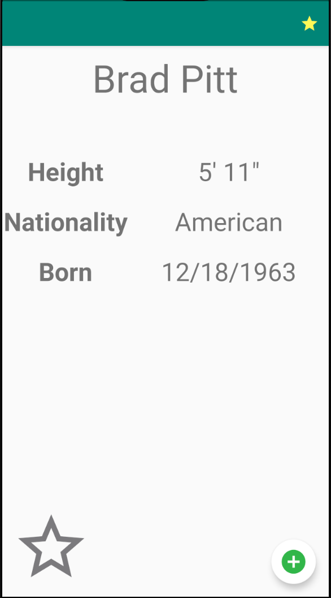
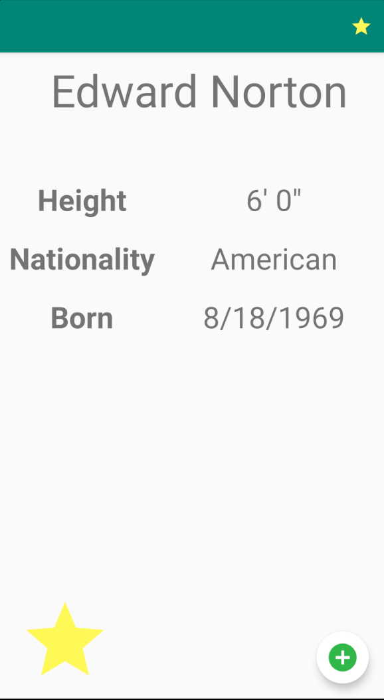

# Week2WeekendCelebrities

## Main Activity
The main activity holds a RecyclerView containing all of the Celebrity entities with the database. The name of the Celebrity is used as the Primary Key. The RecyclerView scrolls horizontally and displays all the information pertaining to each Celebrity. There is a ToggleButton at the bottom left that changes state when clicked and also updates a member variable within the Celebrity Entity to signify that it is favorited. When an item in the RecyclerView is clicked, it takes the user to the ViewCelebrity Activity. The Floating Action Button at the bottom right takes the user to the AddCelebrity Activity. The Star Icon on the Toolbar at the top right takes the user to the MyCelebrities Activity which shows the favorited celebrities.

## View Celebrity Activity
This Activity let's the user view and update the details of a Celebrity. A TextView holds the Celebrity's name, an EditText holds the. Celebrity's Nationality and can be changed, two spinners are used to show and select the Celebrity's height, and a DatePicker is used to show and select the Celebrity's date of birth.

There are two floating action buttons. The red button at the bottom right deletes the Celebrity Entity being shown. The green button at the bottom center updates the Celebrity Entity with the values shown in the various Views.

## Add Celebrity Activity
This Activity is very similar to the ViewCelebrityActivity, but there is an EditText to input the new Celebrity's name, and the other views do not have any values filled in. The green floating action button in the bottom center adds the data in the views as a new Celebrity Entity. If there are any primary key conflicts, the old record is replaced with the new record.

## My Favorite Celebrity Activity
This Activity is very similar to the MainActivity. It uses a RecyclerView with the same layout manager and adapter. The query to the database filters based on the favorite column in the SQLite database. This activity does not have a toolbar displayed at the top, and also features two Floating Action Buttons at the bottom right of the screen. The FAB with the download icon calls a method within FileIOUtil.java that writes the information of favorited celebrities to a file named "favorite_list.txt". The FAB with the notepad icon reads "favorite_list.txt" as long as it exists and displays the information on that file in a Toast.

  

## File I/O
The file input and output for this application is handle by the FileIOUtil class. It contains two methods __writeToFile(context)__ and __readFromFile(context)__. writeToFile queries the SQLite database using a ContentResolver for favorited celebrities and saves them to "favorite_list.txt". readFromFile opens up "favorite_list.txt" saves its contents to a string, then Toasts the string in the passed context.

## Navigation Drawer
This was not implemented.
